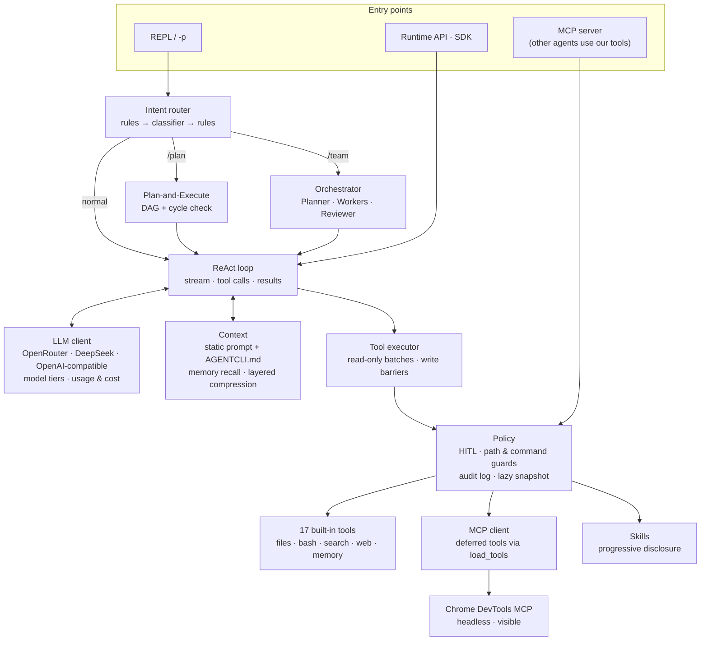

# AgentCLI

A terminal AI coding agent, built from scratch in Python. It reads and edits code, runs commands with your approval, browses the web, uses MCP servers and skills, and splits large tasks across several agents, each on the model that suits it.

```text
██████       ██
██   ██      ██
██████       ██
██  ██   ██  ██
██   ██   ████  's AgentCLI  v1.2.0
```

## Highlights

**Agent loop and safety**
- ReAct engine on `asyncio`: streamed tool calls are assembled as they arrive; consecutive read-only calls run concurrently, and any write is a barrier that runs alone and in order.
- Writes and commands go through human approval (HITL), path isolation, dangerous-command blocking, and a JSONL audit log.
- Edits need a unique match and refuse files that were never read or changed since they were read.
- A workspace snapshot is taken just before a request's first approved write, so a whole turn can be rolled back; read-only requests cost nothing.
- `web_fetch` allows only public addresses and re-checks every redirect hop (SSRF protection).

**Context and prompt caching**
- The system prompt is static for the session. Per-request context (date, recalled memories, skill candidates) rides on the user message, so the provider's prefix cache covers the system prompt, the tools, and every earlier turn.
- Layered compression near the token budget: clear old tool results, then a rolling summary by a light model (extractive fallback), then truncation. It triggers at 80% and compresses to 55%, so it does not fire on every turn.
- Long-term memory in SQLite, recalled per question. `/compact [focus]` on demand, and a reminder when the prompt cache has probably expired.

**Tools, MCP, and skills**
- MCP both ways: as a client (stdio and Streamable HTTP, persistent sessions, cached tool lists) and as a server on the official SDK, with DNS-rebinding protection.
- MCP tools are deferred: requests carry only their names until the model loads what a task needs, so adding servers does not grow every request.
- Two Chrome DevTools MCP browsers: a headless one for JavaScript pages, and a visible one for logins and bot checks, which the user completes.
- Skills (`SKILL.md` + scripts + references) with three-level progressive disclosure: name and description always, the manual when needed, and files on request.

**Multi-agent and model routing**
- `/plan`: the planner builds a DAG, checks it for cycles, and runs steps in dependency order, in parallel where it can.
- `/team`: parallel workers, each reviewed by a model one tier above the worker. A rejection comes back with the issues; repeated rejections move the step up a tier, and a bounded number of escalations ends with the issues handed to the user instead of a retry loop.
- Intent routing before each request: rules first, a cheap classifier only when unsure, the rules as the fallback. Large tasks get a suggestion to switch to `/plan` or `/team`.
- Any OpenAI-compatible provider. A checked OpenRouter catalog with prices, so every answer ends with a line such as:

  ```text
  ✓ openai/gpt-6-luna · 4 model calls · 5 tool calls (web_search×2, web_fetch, load_skill×2) · skills finance-qa, web-access · 52.3k in (40.1k cached) / 2.4k out · $0.014 · 38s
  ```

## Architecture



One request in normal mode:

1. The router estimates the task size and may suggest `/plan` or `/team`.
2. The loop sends the static system prompt, tool definitions, history, and the new message with its per-request context. Compression runs first if the budget is nearly full.
3. The model streams text, reasoning, and tool calls. Calls are grouped: read-only ones run together; a write waits for approval, takes the snapshot if it is the turn's first write, and runs alone.
4. Results go back to the model, and the loop repeats until the model answers without tools, then prints the summary line.

## Quick Start

Requirements: Python 3.11+, [uv](https://docs.astral.sh/uv/). Optional: `rg` for faster search; Node.js and Chrome for the browser tools.

```bash
uv sync --extra dev
```

Set a key (either one), then start the REPL:

```bash
export OPENROUTER_API_KEY=...        # many models through one key
export DEEPSEEK_API_KEY=...          # DeepSeek's own API
uv run agentcli
```

Inside the REPL, just type what you want; use `@path/to/file` to point at a file. `/help` lists every command, and `Shift+Tab` switches the approval mode.

Other ways to run it:

```bash
uv run agentcli -p "Summarize this repository"                                   # one prompt
uv run agentcli --mode plan -p "Read the README and verify the project structure" --json
uv run agentcli --mode team --worker-mode plan -p "Review the core modules in parallel" --json
uv run agentcli doctor --cwd .                                                    # check the setup
uv run agentcli mcp init-chrome --scope user                                      # add the browsers
```

## Configuration

Configuration is loaded in this order, later sources overriding earlier ones:

1. Built-in defaults
2. `~/.agentcli/config.json`
3. Project-level `.agentcli/config.json`
4. Project-level `.env`
5. CLI flags
6. Process environment variables

Use `.env.example` or `.agentcli/config.example.json` as a starting point.

`~/.agentcli` is the default data folder: the user config, `mcp.json`, long-term memory (`memory.db`), the audit log, user skills, snapshots, prompt history, and the visible browser's profile. Set `AGENTCLI_HOME` to keep all of it somewhere else, for example on another drive (`setx AGENTCLI_HOME D:\agentcli-data` on Windows). Every `~/.agentcli` path below then means that folder.

Example `.env`:

```dotenv
AGENTCLI_PROVIDER=openrouter
AGENTCLI_MODEL=openai/gpt-6-luna
OPENROUTER_API_KEY=your_key_here
```

`AGENTCLI_API_KEY` works for any provider. Provider-specific keys: `OPENROUTER_API_KEY`, `DEEPSEEK_API_KEY`, `ZAI_API_KEY` / `GLM_API_KEY`, `KIMI_API_KEY`, `STEP_API_KEY`.

With one `OPENROUTER_API_KEY`, `/model` offers a checked set of models: GPT-6 Astra, Sol and Luna, Claude Opus 5.5, DeepSeek V4 Flash / V4.1 Flash / V4 Pro 0813, GLM-5.3 and GLM-5.3 Flash, Qwen3.8 Flash, and Gemini 3.8 Flash. Each passed a tool-calling run through AgentCLI before being listed and carries OpenRouter's published prices (dated in `llm/pricing.py`). Any other OpenRouter model id works too, without built-in prices.

Local OpenAI-compatible services work as well:

```bash
AGENTCLI_PROVIDER=openai-compatible \
AGENTCLI_BASE_URL=http://127.0.0.1:11434/v1 \
AGENTCLI_MODEL=qwen2.5-coder \
uv run agentcli -p "Explain this repository"
```

## REPL Commands

| Command | What it does |
| --- | --- |
| `/help`, `/exit`, `/clear` | Help, quit, start a new conversation |
| `/model [provider] [model-id]` | Pick or switch the model |
| `/plan <task>` | Plan as a DAG, then run the steps in dependency order |
| `/team [--plan] <task>` | Planner, parallel workers, and a reviewer |
| `/compact [focus]` | Summarize the conversation now, keeping the focus in detail |
| `/context`, `/usage` | Context size and breakdown; tokens and cost |
| `/memory [search\|stats\|delete\|clear]`, `/save <fact>` | Long-term memory |
| `/skill [list\|show\|on\|off\|reload] [name]` | Skills |
| `/tools`, `/mcp` | Tools and MCP servers |
| `/hitl default\|auto`, `/policy`, `/audit [N]` | Approval mode, policy, audit log |
| `/snapshot [clean]`, `/restore <id-or-index>` | Snapshots and rollback |
| `/task [add\|cancel\|log]` | Background tasks |
| `/index [path]`, `/search <query>` | Code index and search |
| `/config` | Effective configuration |

## Built-In Tools

`read_file`, `write_file`, `edit_file`, `list_dir`, `directory_tree`, `get_file_info`, `glob`, `grep`, `search_code`, `bash`, `web_search`, `web_fetch`, `save_memory`, `search_memory`, `load_skill`, `save_skill`, `revert_turn`. When MCP servers are configured, `load_tools` is added to load their tools on demand.

File writes, commands, MCP tools that change things, snapshot restore, and skill saving go through the policy, approval, and audit layer. With the default `auto` policy they need approval. In single-prompt mode there is no one to approve, so pass `--hitl never` only inside a sandbox you are willing to let the agent change.

An MCP tool's own `readOnlyHint` lets it skip approval only when its server entry sets `"trusted": true`, because a server describes itself and an untrusted one could claim to be read-only.

## Memory And Context

AgentCLI uses three memory layers:

- Short-term: the current session's messages and tool results.
- Static long-term: project instruction files in the system prompt. `AGENTS.md`, `AGENTCLI.md`, and `AGENTCLI.local.md` in the project root or `.agentcli/`, plus any paths in `prompt.custom_prompt_paths`. Put project rules, test and run commands, and conventions there.
- Dynamic long-term: project-scoped SQLite records with kind, source, importance, confidence, TTL, access count, and content hash, recalled by relevance to each question.

The system prompt is fully static for a session. Per-request context (date, working directory, recalled memories, skill candidates) is attached to the user message that triggered it and then stays frozen in history, so the prefix cache covers the system prompt, tool definitions, and all earlier turns.

When the estimated input reaches `memory.compression_threshold` of the budget, compression runs in layers and stops as soon as the request fits under `memory.compression_target`:

1. Old tool results beyond the newest `memory.keep_recent_tool_results` are replaced with short stubs.
2. Older turns are folded into one rolling summary, written by `memory.summary_model` (empty means the session model) when the older part exceeds `memory.min_llm_summary_tokens`; otherwise, or on failure, an extractive summary is used. Set `memory.llm_summary` to `false` to never call a model.
3. Oversized tool payloads in the retained turns are truncated.

Recent turns and complete tool-call/result pairs are always kept verbatim. The summary is session state and is never written to long-term memory.

Providers keep the prompt cache only for a while and do not report when it expires. When you come back after `memory.cache_ttl_minutes` (default 60) with a context of at least `memory.idle_reminder_min_tokens` (default 30,000), the REPL says so before sending, with the extra cost when the model has prices. You can send anyway, compact first, or cancel. After `memory.stale_session_hours` (default 8) it suggests compacting first.

## Routing

Before a request runs in normal mode, AgentCLI estimates how big it is. Built-in rules decide instantly when the signal is clear (length, step words such as "首先/然后/最后", listed items, scope words such as "整个/重构/迁移", fan-out words such as "分别/并行"). Only unclear requests go to a classifier, tried in the order of `routing.classifiers`: Jev (`jev_enabled` plus `TYPESAFE_API_KEY`), then a cheap model (`classifier_model`). Each has a timeout, and a classifier that is disabled, slow, or down is skipped, so the rules' verdict is always the fallback.

`/plan` and `/team` can use a different model per role, as `"provider:model"`:

```json
{
  "routing": {
    "planner_model": "openrouter:anthropic/claude-opus-5.5",
    "fast_model": "openrouter:openai/gpt-6-luna",
    "strong_model": "openrouter:openai/gpt-6-sol",
    "top_model": "openrouter:anthropic/claude-opus-5.5"
  }
}
```

The planner writes each step as self-contained instructions and marks it easy or hard. Easy steps run on the fast model, hard ones on the strong model. In `/team` the reviewer is always one tier above the worker, so no model grades its own work. After `attempts_per_tier` rejections (default 2) a step moves up one tier, at most `max_escalations` times (default 1); if it is still rejected it fails with the reviewer's issues in the final report. Unset roles use the session model, and so does a role whose provider key is missing.

## Skills

A skill is a folder with a `SKILL.md` manual (YAML frontmatter with `name` and `description`, then instructions) and, optionally, scripts and reference files the manual points to. The format matches the SKILL.md skills published for other agents, so most of them install unchanged.

Skills are found in three places, later ones overriding earlier ones: built-in, `~/.agentcli/skills/<name>/` (every project), and `<project>/.agentcli/skills/<name>/` (one project). Every enabled skill's name and description is listed in the `load_skill` tool; the full manual is only read when a task needs it, and loading it also tells the model the skill's folder and files.

```bash
uv run agentcli skill add examples/skills/finance-qa          # install for all projects
uv run agentcli skill add path/to/skill --scope project       # this project only
uv run agentcli skill list
```

Built in: `web-access` (how to research the web: search, fetch, then the browsers). In `examples/skills/`:

- `pdf-tools`: text, tables, search, merge, and split for PDF files (`pip install pypdf pdfplumber`)
- `office-docs`: read and create Word, Excel, and PowerPoint files (`pip install python-docx openpyxl python-pptx`)
- `finance-qa`: company and stock questions, with a calculator script so figures are computed, not guessed
- `trump-style`, `sun-yuchen-style`: parody voices for code reviews and release notes

## MCP

Add browsers for the agent (pages that need JavaScript, or a login):

```bash
uv run agentcli mcp init-chrome --scope user
```

This writes two `chrome-devtools-mcp` servers, both with a pinned version and usage reporting off:

- `chrome-devtools`: headless, with a throwaway `--isolated` profile, for public pages that only need JavaScript to render.
- `chrome-visible`: a window you can see, with a saved AgentCLI-only profile in `~/.agentcli/browser-profile`, separate from your own Chrome. For sites behind a login or a bot check, you sign in or complete the check yourself, and the login is kept for next time. Delete the folder to forget every login. `--no-visible` skips it.

Both are marked `"trusted": true`, so the server's own read-only tools skip approval while navigation, snapshots, clicks, and scripts still ask.

MCP servers cost nothing until they are used:

- Startup reads each server's tool list from a cache in `~/.agentcli/mcp-cache` instead of launching it. The cache is keyed on the server's command, arguments, and environment, so editing the config refreshes it; `agentcli mcp refresh` clears it.
- MCP tools are deferred: requests carry only their names (in `load_tools`), and the model loads the tools a task needs. Set `"defer": false` on a server to always send its tools.
- A server starts on the first call to one of its tools, keeps one connection for the rest of the session (a page opened by `navigate_page` is still there for `take_snapshot`), and is stopped with the browsers it launched when the session ends.

Expose AgentCLI's tools as an MCP server, so another agent or IDE can use them:

```bash
uv run agentcli mcp serve --transport stdio --cwd /path/to/project
uv run agentcli mcp serve --transport http --port 3000      # http://127.0.0.1:3000/mcp
uv run agentcli mcp serve --read-only                       # only tools that change nothing
```

The server is built on the official MCP SDK. Each tool is annotated as read-only or destructive so the client can ask for approval accordingly, and AgentCLI's path and command guards still apply. HTTP listens on 127.0.0.1 only and rejects requests whose Host or Origin is not local, so a web page open in your browser cannot drive it. For example, to let Claude Code use AgentCLI's tools:

```bash
claude mcp add agentcli -- uv run --project /path/to/AgentCLI agentcli mcp serve --cwd /path/to/project
```

## Runtime API And SDK

Start the HTTP runtime, then create threads, send turns, or queue background tasks:

```bash
AGENTCLI_RUNTIME_API_KEY=dev-key uv run agentcli serve --http --port 8080

curl -sS -X POST http://127.0.0.1:8080/v1/threads -H 'x-api-key: dev-key'
curl -sS -X POST http://127.0.0.1:8080/v1/threads/<thread_id>/turns \
  -H 'content-type: application/json' -H 'x-api-key: dev-key' \
  -d '{"message":"Summarize this project"}'
curl -sS -X POST http://127.0.0.1:8080/v1/tasks \
  -H 'content-type: application/json' -H 'x-api-key: dev-key' \
  -d '{"message":"Analyze this repository in the background","mode":"plan"}'

uv run agentcli worker --workers 2 --cwd .      # run tasks without exposing HTTP
```

From Python:

```python
from agentcli.sdk import create_default_engine

engine = create_default_engine(cwd=".")
print(engine.ask_complete("Explain this project").text)
plan_result = engine.plan_complete("Read README first, then summarize the architecture")
team_result = engine.team_complete("Ask multiple agents to inspect core modules")
```

## Development

```bash
uv sync --extra dev
uv run python -m ruff check .
uv run python -m ruff format --check .
uv run python -m pytest
uv build
```

Source layout (`src/agentcli/`): `agent/` (ReAct loop, plan-and-execute, orchestrator), `routing/` (intent and model tiers), `llm/` (clients, catalog, prices), `context/` and `prompt/` (compression, prompt assembly), `memory/`, `tools/`, `policy/` (guards, approval, audit), `snapshot/`, `mcp/` (client, server, config), `skill/`, `web/`, `runtime/`, `entrypoints/` (CLI and REPL), `render/`.

## License

MIT. See [LICENSE](LICENSE).
